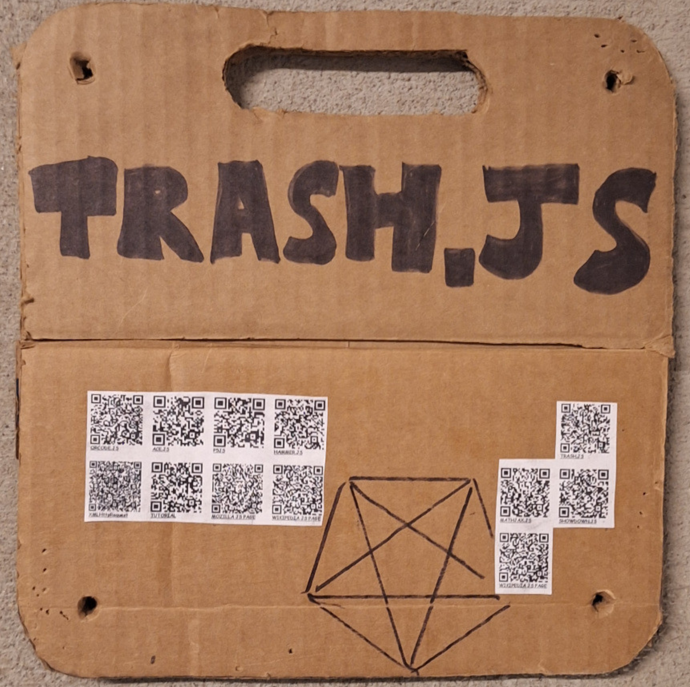

# [TRASH.JS](https://github.com/LafeLabs/TRASH.JS)

THE TRASH IS THE JAVASCRIPT!

THE JAVASCRIPT IS THE TRASH!

 - [HOME](index.html)
 - [editor.php](editor.php)
 - [webeditor.html](webeditor.html)
 - [readme.html](readme.html)
 - [TRASH.JS](https://github.com/LafeLabs/TRASH.JS)
 - [hyperspace-editor.html](hyperspace-editor.html)
 - [hyperspace.txt](hyperspace.txt)
 - [QRCODE.JS](https://davidshimjs.github.io/qrcodejs/)
 - [ACE.JS](https://ace.c9.io/)
 - [P5JS](https://p5js.org/)
 - [HAMMER.JS](https://hammerjs.github.io/)
 - [MATHJAX.JS](https://www.mathjax.org/)
 - [SHOWDOWN.JS](https://showdownjs.com/)
 - [GEOMETRON.JS](geometron.js)
 - [TRASHMAGIC.JS](trashmagic.js)
 - [XMLHttpRequest](https://developer.mozilla.org/en-US/docs/Web/API/XMLHttpRequest)
 - [TUTORIAL](https://www.w3schools.com/js/)
 - [MOZILLA JS PAGE](https://developer.mozilla.org/en-US/docs/Web/JavaScript)
 - [WIKIPEDIA JS PAGE](https://en.wikipedia.org/wiki/JavaScript)
 - [WIKIPEDIA JS PAGE](https://en.wikipedia.org/wiki/JavaScript)
 - [QR CODES](hyperspace-page.html)

